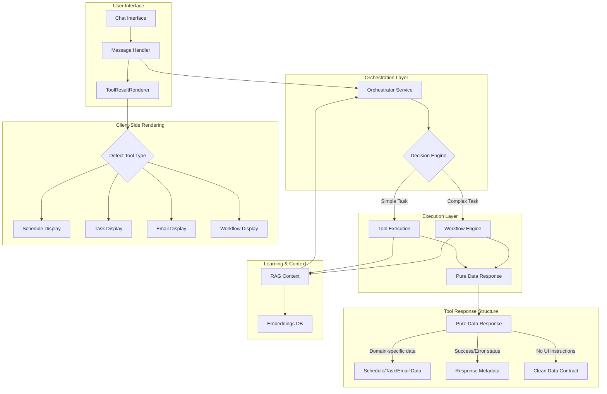

# AI System Reference Documentation

## System Architecture Overview

The Dayli AI assistant operates through a sophisticated multi-layered architecture designed for extensibility, personalization, and efficient task execution.



## Core Components

### 1. Orchestration Service
The brain of the system that intelligently routes requests:

```typescript
class OrchestrationService {
  async processMessage(message: string, context: Context) {
    // Analyze intent and complexity
    const analysis = await this.analyzeRequest(message, context);
    
    if (analysis.requiresWorkflow) {
      return this.executeWorkflow(analysis.workflowType, analysis.params);
    } else {
      return this.executeTool(analysis.toolName, analysis.params);
    }
  }
}
```

**Key Responsibilities:**
- Intent classification (tool vs workflow)
- Context building from RAG
- Parameter extraction
- Response coordination

### 2. Tool System

Tools are atomic operations that return pure domain data without any UI formatting instructions:

```typescript
// Tool Factory Pattern
export function createTool<TParams, TResponse extends BaseToolResponse>({
  name: string,
  description: string,
  parameters: ZodSchema,
  metadata: ToolMetadata,
  execute: (params: TParams) => Promise<TResponse>
}) {
  // Consistent error handling, logging, and response structure
}

// Base Response Interface
interface BaseToolResponse {
  success: boolean;
  error?: string;
  timestamp?: Date;
}

// Example Tool Response - Pure Data Only
interface ScheduleViewResponse extends BaseToolResponse {
  success: boolean;
  date: string;
  blocks: TimeBlock[];
  stats: ScheduleStats;
  // No UI instructions - just data
}

// Tool Implementation Example
export const viewSchedule = registerTool(
  createTool<typeof parameters, ScheduleViewResponse>({
    name: 'schedule_viewSchedule',
    description: 'View schedule for a specific date',
    parameters: z.object({
      date: z.string().optional()
    }),
    metadata: {
      category: 'schedule',
      displayName: 'View Schedule',
      requiresConfirmation: false,
      supportsStreaming: false,
    },
    execute: async ({ date }) => {
      // Return only domain data
      return {
        success: true,
        date: targetDate,
        blocks: scheduleBlocks,
        stats: calculateStats(blocks)
      };
    }
  })
);
```

**Tool Categories:**
- **Schedule** (5 tools): View, create, move, delete, fill time blocks
- **Task** (4 tools): View, create, update, complete tasks  
- **Email** (3 tools): View, read, process emails
- **Calendar** (2 tools): Schedule, reschedule meetings
- **Preference** (1 tool): Update user preferences
- **System** (6 tools): Confirmations, history, feedback, patterns
- **Workflow** (4 tools): Complex multi-step operations

### 3. Workflow Engine (LangGraph)

Workflows handle complex, multi-step operations with state management:

```typescript
// Workflow Definition
const emailTriageWorkflow = new StateGraph({
  // State definition
  channels: {
    emails: { value: [] },
    decisions: { value: [] },
    errors: { value: [] }
  }
})
  .addNode("fetch_emails", fetchEmailsNode)
  .addNode("analyze_urgency", analyzeUrgencyNode)
  .addNode("extract_actions", extractActionsNode)
  .addNode("generate_proposals", generateProposalsNode)
  .addNode("await_confirmation", awaitConfirmationNode)
  .addNode("execute_actions", executeActionsNode)
  .addNode("update_context", updateContextNode)
  .addEdge("fetch_emails", "analyze_urgency")
  .addEdge("analyze_urgency", "extract_actions")
  .addEdge("extract_actions", "generate_proposals")
  .addEdge("generate_proposals", "await_confirmation")
  .addConditionalEdges("await_confirmation", {
    approved: "execute_actions",
    rejected: END,
    modified: "generate_proposals"
  })
  .addEdge("execute_actions", "update_context")
  .addEdge("update_context", END);
```

**Available Workflows:**

1. **Email Triage Workflow** (`workflow_triageEmails`)
   - **Nodes**: 
     - `fetch_emails`: Retrieve unread emails from Gmail
     - `analyze_urgency`: Score emails based on sender, subject, content
     - `extract_actions`: Identify required actions (reply, task, calendar)
     - `generate_proposals`: Create action proposals for each email
     - `await_confirmation`: Present proposals to user for approval
     - `execute_actions`: Execute approved actions (create tasks, draft replies)
     - `update_context`: Store decisions for future learning
   - **Handles**: Batch email processing with intelligent action extraction
   - **Returns**: Email decisions, created tasks, draft responses

2. **Schedule Optimization Workflow** (`workflow_optimizeSchedule`)
   - **Nodes**:
     - `fetch_schedule`: Get current schedule for target date
     - `analyze_patterns`: Identify gaps, conflicts, and inefficiencies
     - `identify_conflicts`: Find overlapping blocks and time conflicts
     - `generate_optimizations`: Create optimization proposals (move, merge, split)
     - `await_confirmation`: User reviews proposed changes
     - `apply_changes`: Execute approved schedule modifications
     - `update_calendar`: Sync changes with external calendar
   - **Handles**: Full day schedule optimization with conflict resolution
   - **Returns**: Original schedule, optimized schedule, change list, metrics

3. **Daily Planning Workflow** (`workflow_dailyPlanning`)
   - **Nodes**:
     - `gather_context`: Collect user preferences, energy levels, priorities
     - `fetch_tasks`: Get unscheduled tasks from backlog
     - `analyze_priorities`: Score and rank tasks by urgency/importance
     - `generate_schedule`: Create optimal time block assignments
     - `await_confirmation`: User approves proposed schedule
     - `create_blocks`: Create time blocks with assigned tasks
     - `send_notifications`: Notify user of created schedule
   - **Handles**: Morning planning routine with task scheduling
   - **Returns**: Created blocks, assigned tasks, planning metrics

4. **Calendar Optimization Workflow** (`workflow_optimizeCalendar`)
   - **Nodes**:
     - `fetch_meetings`: Get meetings for date range
     - `analyze_conflicts`: Identify scheduling conflicts and issues
     - `find_alternatives`: Search for better time slots
     - `generate_proposals`: Create rescheduling proposals
     - `await_confirmation`: User approves meeting changes
     - `reschedule_meetings`: Execute calendar updates
     - `notify_attendees`: Send notifications to affected attendees
   - **Handles**: Meeting conflict resolution and optimization
   - **Returns**: Meeting changes, conflict resolutions, optimization metrics

### 4. RAG Context System

Three-layer context building for personalized responses:

```typescript
class RAGContextProvider {
  async buildContext(query: string, userId: string) {
    // Layer 1: Recent tool executions (pure data)
    const recentTools = await this.getRecentToolResults(userId, 7);
    
    // Layer 2: Workflow patterns
    const patterns = await this.getWorkflowPatterns(userId);
    
    // Layer 3: User preferences
    const preferences = await this.getUserPreferences(userId);
    
    return {
      immediate: recentTools.slice(0, 5),
      patterns: patterns,
      preferences: preferences
    };
  }
  
  // Embed pure tool results for learning
  async embedToolResult(toolName: string, result: BaseToolResponse) {
    const embedding = await generateEmbedding({
      tool: toolName,
      data: result,
      timestamp: new Date()
    });
    await this.store(embedding);
  }
}
```

### 5. Client-Side Rendering

The UI intelligently renders tool results based on their type:

```typescript
// ToolResultRenderer routes to appropriate display
export function ToolResultRenderer({ toolName, result, metadata }) {
  // Use metadata or name to determine display type
  const displayType = metadata?.category || detectTypeFromName(toolName);
  
  // Lazy load appropriate display component
  const Display = displays[displayType];
  return <Display data={result} />;
}

// Specialized displays for each data type
const displays = {
  schedule: ScheduleDisplay,    // Timeline view
  task: TaskListDisplay,        // Task cards
  email: EmailListDisplay,      // Email previews
  meeting: MeetingDisplay,      // Calendar event
  workflow: WorkflowDisplay,    // Multi-step results
  confirmation: ConfirmDialog   // Action confirmation
};
```

## Data Flow Example

Let's trace a request through the system:

1. **User**: "Optimize my schedule for tomorrow"

2. **Orchestrator Analysis**:
   ```typescript
   {
     intent: "schedule_optimization",
     complexity: "high",
     requiresWorkflow: true,
     workflowType: "optimizeSchedule",
     params: { date: "2024-01-20" }
   }
   ```

3. **Workflow Execution**:
   - fetch_schedule → Returns pure schedule data
   - analyze_patterns → Identifies gaps and conflicts
   - generate_optimizations → Creates proposals
   - await_confirmation → User reviews changes
   - apply_changes → Updates schedule
   - update_calendar → Syncs with calendar

4. **Pure Data Response**:
   ```typescript
   {
     success: true,
     date: "2024-01-20",
     originalSchedule: [...],
     optimizedSchedule: [...],
     changes: [
       { type: "move", description: "...", impact: "..." }
     ],
     metrics: {
       focusTimeGained: 90,
       utilizationImproved: 15
     }
   }
   ```

5. **Client Rendering**:
   - ToolResultRenderer detects "workflow" type
   - Loads WorkflowDisplay component
   - Shows before/after comparison
   - Provides action buttons

## Tool Categories Deep Dive

### Schedule Tools
Manage time blocks and daily schedules:
- `viewSchedule`: Returns blocks, stats, utilization
- `createTimeBlock`: Returns new block, conflicts
- `moveTimeBlock`: Returns updated block, previous time
- `deleteTimeBlock`: Returns deleted ID and title
- `fillWorkBlock`: Returns block ID, assigned tasks

### Task Tools
Handle task management and prioritization:
- `viewTasks`: Returns tasks with scores, filters, stats
- `createTask`: Returns task, auto-schedule flag
- `updateTask`: Returns task, changed fields
- `completeTask`: Returns ID, title, time spent

### Email Tools
Process and manage emails:
- `viewEmails`: Returns emails with urgency scores
- `readEmail`: Returns full content, action items
- `processEmail`: Returns action-specific results

### System Tools
Provide system-level functionality:
- `confirmProposal`: Handle workflow confirmations
- `showWorkflowHistory`: Display past executions
- `resumeWorkflow`: Continue paused workflows
- `provideFeedback`: Collect user feedback
- `showPatterns`: Display usage patterns
- `clearContext`: Reset conversation context

## Streaming Support

Long-running operations support progress streaming:

```typescript
// Streaming tool definition
export const optimizeSchedule = createStreamingTool({
  stages: [
    { name: "Fetching data", weight: 20, execute: fetchData },
    { name: "Analyzing", weight: 30, execute: analyze },
    { name: "Optimizing", weight: 30, execute: optimize },
    { name: "Validating", weight: 20, execute: validate }
  ],
  finalizeResult: (context) => ({
    success: true,
    ...context.validated
  })
});

// Client shows progress
<ProgressBar stage="Analyzing" progress={30} />
```

## Error Handling

Consistent error handling across all tools:

```typescript
// All tools return consistent error structure
interface ErrorResponse extends BaseToolResponse {
  success: false;
  error: string;
  errorCode?: string;
  retryable?: boolean;
}

// Client handles errors gracefully
if (!result.success) {
  return <ErrorDisplay error={result.error} />;
}
```

## Performance Optimizations

1. **Lazy Loading**: Display components loaded on demand
2. **Streaming**: Progress updates for long operations
3. **Caching**: Recent tool results cached in RAG
4. **Parallel Execution**: Tools can run in parallel
5. **Pure Data**: No LLM formatting overhead

## Migration from UniversalToolResponse

The system has migrated from the complex `UniversalToolResponse` format to pure data returns:

**Before (UniversalToolResponse):**
```typescript
{
  metadata: { toolName, operation, resourceType, ... },
  data: { /* domain data */ },
  display: { type, title, components: [...] },
  ui: { suggestions: [...], actions: [...] },
  streaming: { ... }
}
```

**After (Pure Data):**
```typescript
{
  success: boolean,
  error?: string,
  // Domain-specific data only
  blocks?: TimeBlock[],
  tasks?: Task[],
  emails?: Email[],
  // No UI instructions
}
```

**Benefits:**
- Simpler tool implementations
- No AI formatting overhead
- Predictable UI rendering
- Better type safety
- Easier testing

## Future Extensibility

The architecture supports easy addition of:
- New tools (via tool factory)
- New workflows (via LangGraph)
- New display types (via display components)
- New data sources (via service interfaces)
- Enhanced learning (via RAG extensions)

The system's strength lies not in any single component, but in how these pieces work together - the orchestrator's intelligence in routing, the tools' focused efficiency, the workflows' handling of complexity, and RAG's continuous personalization create an assistant that becomes more valuable with every interaction. 