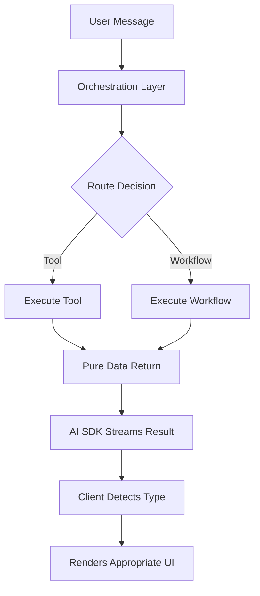

# Sprint Fix-AI: AI Tool Response System Overhaul

**Sprint Goal**: Fix AI tool response display by adopting AI SDK native patterns  
**Duration**: 5 days  
**Priority**: CRITICAL - Blocking Epic 4 progress  
**Status**: IN PROGRESS - Day 2

## Problem Statement

Our AI tool responses are not displaying properly in the chat UI due to a fundamental architectural mismatch:

1. **Tools return `UniversalToolResponse`** with complex UI instructions
2. **AI SDK wraps this** in its own structure (`toolInvocations`)
3. **UI tries to detect and unwrap** the nested structure (fragile logic)
4. **Result**: Tool responses don't render, streaming doesn't work

## Solution: Pure Data + Client-Side Rendering

Adopt AI SDK native patterns by:
1. Tools return pure domain data (no UI instructions)
2. Client detects data type from tool name and renders appropriate UI
3. Streaming supported natively through AI SDK's built-in capabilities

## Architecture Diagram



## Implementation Plan

### Day 1: Tool Response Refactoring (Schedule & Task Tools)

#### Morning: Create New Response Types

**File: `apps/web/modules/ai/tools/types/responses.ts`** (NEW)
```typescript
// Pure data types returned by tools
export interface ScheduleViewResponse {
  date: string;
  blocks: Array<{
    id: string;
    type: 'work' | 'meeting' | 'email' | 'break' | 'blocked';
    title: string;
    startTime: Date;
    endTime: Date;
    description?: string;
    tasks?: Array<{
      id: string;
      title: string;
      completed: boolean;
    }>;
  }>;
  stats: {
    totalHours: number;
    focusHours: number;
    meetingHours: number;
    utilization: number;
  };
}

export interface TaskListResponse {
  tasks: Array<{
    id: string;
    title: string;
    priority: 'high' | 'medium' | 'low';
    status: 'active' | 'completed' | 'backlog';
    score?: number;
    estimatedMinutes?: number;
    daysInBacklog?: number;
  }>;
  stats: {
    total: number;
    completed: number;
    highPriority: number;
    totalEstimatedHours: number;
  };
}

// ... define for all 25 tools
```

#### Late Morning: Create Tool Factory Pattern

**File: `apps/web/modules/ai/tools/base/tool-factory.ts`** (NEW)
```typescript
import { tool as aiTool } from 'ai';
import { z } from 'zod';

// Base interface for all tool responses
export interface BaseToolResponse {
  success: boolean;
  error?: string;
  timestamp?: Date;
}

// Tool metadata for better organization
export interface ToolMetadata {
  category: 'schedule' | 'task' | 'email' | 'calendar' | 'preference' | 'workflow' | 'system';
  displayName: string;
  requiresConfirmation?: boolean;
  supportsStreaming?: boolean;
}

// Factory function for creating consistent tools
export function createTool<TParams extends z.ZodType, TResponse extends BaseToolResponse>(
  config: {
    name: string;
    description: string;
    parameters: TParams;
    metadata: ToolMetadata;
    execute: (params: z.infer<TParams>) => Promise<TResponse>;
    // Optional streaming implementation
    executeStream?: (params: z.infer<TParams>) => AsyncGenerator<{
      progress: number;
      stage: string;
      partialResult?: Partial<TResponse>;
    }>;
  }
) {
  // Add consistent error handling and logging
  const wrappedExecute = async (params: z.infer<TParams>): Promise<TResponse> => {
    const startTime = Date.now();
    try {
      console.log(`[Tool: ${config.name}] Starting execution`, { params });
      
      const result = await config.execute(params);
      
      // Ensure consistent response structure
      const response = {
        ...result,
        success: result.success ?? true,
        timestamp: new Date(),
      };
      
      console.log(`[Tool: ${config.name}] Completed in ${Date.now() - startTime}ms`);
      return response;
      
    } catch (error) {
      console.error(`[Tool: ${config.name}] Error:`, error);
      
      // Return consistent error response
      return {
        success: false,
        error: error instanceof Error ? error.message : 'Unknown error occurred',
        timestamp: new Date(),
      } as TResponse;
    }
  };
  
  // Create the AI SDK tool
  const tool = aiTool({
    description: config.description,
    parameters: config.parameters,
    execute: config.executeStream ? config.executeStream : wrappedExecute,
  });
  
  // Attach metadata for runtime access
  (tool as any).__metadata = config.metadata;
  (tool as any).__name = config.name;
  
  return tool;
}

// Helper to create streaming tools
export function createStreamingTool<TParams extends z.ZodType, TResponse extends BaseToolResponse>(
  config: {
    name: string;
    description: string;
    parameters: TParams;
    metadata: ToolMetadata;
    stages: Array<{
      name: string;
      weight: number; // Progress weight (should sum to 100)
      execute: (params: z.infer<TParams>, context: any) => Promise<any>;
    }>;
    finalizeResult: (context: any) => TResponse;
  }
) {
  const executeStream = async function* (params: z.infer<TParams>) {
    const context: any = {};
    let totalProgress = 0;
    
    for (const stage of config.stages) {
      yield {
        progress: totalProgress,
        stage: stage.name,
      };
      
      try {
        context[stage.name] = await stage.execute(params, context);
        totalProgress += stage.weight;
        
        yield {
          progress: totalProgress,
          stage: `${stage.name} complete`,
          partialResult: context,
        };
      } catch (error) {
        yield {
          progress: totalProgress,
          stage: `Error in ${stage.name}: ${error}`,
          partialResult: context,
        };
        throw error;
      }
    }
    
    // Final result
    const result = config.finalizeResult(context);
    yield {
      progress: 100,
      stage: 'Complete',
      result,
    };
  };
  
  return createTool({
    ...config,
    executeStream,
    execute: async (params) => {
      // Fallback for non-streaming execution
      const context: any = {};
      for (const stage of config.stages) {
        context[stage.name] = await stage.execute(params, context);
      }
      return config.finalizeResult(context);
    },
  });
}

// Type guard to check if a tool supports streaming
export function supportsStreaming(tool: any): boolean {
  return tool.__metadata?.supportsStreaming === true;
}

// Get tool category for display routing
export function getToolCategory(tool: any): string {
  return tool.__metadata?.category || 'unknown';
}
```

**File: `apps/web/modules/ai/tools/base/tool-registry.ts`** (NEW)
```typescript
// Central registry for all tools
export class ToolRegistry {
  private static instance: ToolRegistry;
  private tools = new Map<string, any>();
  private categories = new Map<string, Set<string>>();
  
  static getInstance(): ToolRegistry {
    if (!ToolRegistry.instance) {
      ToolRegistry.instance = new ToolRegistry();
    }
    return ToolRegistry.instance;
  }
  
  register(tool: any): void {
    const name = tool.__name;
    const category = tool.__metadata?.category;
    
    if (!name) {
      throw new Error('Tool must have a name');
    }
    
    this.tools.set(name, tool);
    
    if (category) {
      if (!this.categories.has(category)) {
        this.categories.set(category, new Set());
      }
      this.categories.get(category)!.add(name);
    }
    
    console.log(`[ToolRegistry] Registered tool: ${name} in category: ${category}`);
  }
  
  getAll(): Record<string, any> {
    return Object.fromEntries(this.tools);
  }
  
  getByCategory(category: string): any[] {
    const toolNames = this.categories.get(category) || new Set();
    return Array.from(toolNames).map(name => this.tools.get(name)).filter(Boolean);
  }
  
  get(name: string): any {
    return this.tools.get(name);
  }
}

// Helper to auto-register tools
export function registerTool(tool: any): any {
  ToolRegistry.getInstance().register(tool);
  return tool;
}
```

#### Afternoon: Update Schedule Tools (5 tools)

**Files to modify:**
1. `apps/web/modules/ai/tools/schedule/viewSchedule.ts`
2. `apps/web/modules/ai/tools/schedule/createTimeBlock.ts`
3. `apps/web/modules/ai/tools/schedule/moveTimeBlock.ts`
4. `apps/web/modules/ai/tools/schedule/deleteTimeBlock.ts`
5. `apps/web/modules/ai/tools/schedule/fillWorkBlock.ts`

**Example transformation for viewSchedule.ts:**
```typescript
// BEFORE
export const viewSchedule = tool({
  description: 'View schedule for a date',
  parameters: z.object({
    date: z.string().optional()
  }),
  execute: async ({ date }): Promise<UniversalToolResponse> => {
    // ... complex logic
    return buildToolResponse(
      toolOptions,
      scheduleData,
      { type: 'timeline', title: '...', components: [...] },
      { suggestions: [...], actions: [...] }
    );
  }
});

// AFTER - Using Tool Factory
import { createTool, registerTool } from '../base/tool-factory';
import { BaseToolResponse } from '../base/tool-factory';

interface ScheduleViewResponse extends BaseToolResponse {
  date: string;
  blocks: Array<{
    id: string;
    type: 'work' | 'meeting' | 'email' | 'break' | 'blocked';
    title: string;
    startTime: Date;
    endTime: Date;
    description?: string;
    tasks?: Array<{
      id: string;
      title: string;
      completed: boolean;
    }>;
  }>;
  stats: {
    totalHours: number;
    focusHours: number;
    meetingHours: number;
    utilization: number;
  };
}

export const viewSchedule = registerTool(
  createTool<typeof parameters, ScheduleViewResponse>({
    name: 'schedule_viewSchedule',
    description: 'View schedule for a specific date',
    parameters: z.object({
      date: z.string().optional().describe('Date in YYYY-MM-DD format')
    }),
    metadata: {
      category: 'schedule',
      displayName: 'View Schedule',
      requiresConfirmation: false,
      supportsStreaming: false,
    },
    execute: async ({ date }) => {
      const targetDate = date || format(new Date(), 'yyyy-MM-dd');
      const scheduleService = ServiceFactory.getInstance().getScheduleService();
      const blocks = await scheduleService.getScheduleForDate(targetDate);
      
      return {
        success: true,
        date: targetDate,
        blocks: blocks.map(b => ({
          id: b.id,
          type: b.type,
          title: b.title,
          startTime: b.startTime,
          endTime: b.endTime,
          description: b.description,
          tasks: b.tasks
        })),
        stats: calculateScheduleStats(blocks)
      };
    }
  })
);
```

**Example streaming tool - optimizeSchedule.ts:**
```typescript
import { createStreamingTool, registerTool } from '../base/tool-factory';

interface OptimizeScheduleResponse extends BaseToolResponse {
  date: string;
  originalSchedule: TimeBlock[];
  optimizedSchedule: TimeBlock[];
  changes: Array<{
    type: 'move' | 'merge' | 'split' | 'delete';
    description: string;
    impact: string;
  }>;
  metrics: {
    focusTimeGained: number;
    fragmentationReduced: number;
    utilizationImproved: number;
  };
}

export const optimizeSchedule = registerTool(
  createStreamingTool<typeof parameters, OptimizeScheduleResponse>({
    name: 'workflow_optimizeSchedule',
    description: 'Optimize schedule by consolidating time blocks and reducing fragmentation',
    parameters: z.object({
      date: z.string().describe('Date to optimize in YYYY-MM-DD format'),
      preferences: z.object({
        minFocusBlock: z.number().default(90),
        preferredBreakDuration: z.number().default(15),
        consolidateSimilarTasks: z.boolean().default(true),
      }).optional(),
    }),
    metadata: {
      category: 'workflow',
      displayName: 'Optimize Schedule',
      requiresConfirmation: true,
      supportsStreaming: true,
    },
    stages: [
      {
        name: 'Fetching schedule data',
        weight: 20,
        execute: async ({ date }, context) => {
          const scheduleService = ServiceFactory.getInstance().getScheduleService();
          const schedule = await scheduleService.getScheduleForDate(date);
          const tasks = await scheduleService.getTasksForDate(date);
          return { schedule, tasks };
        },
      },
      {
        name: 'Analyzing patterns',
        weight: 30,
        execute: async ({ preferences }, context) => {
          const { schedule, tasks } = context['Fetching schedule data'];
          const analysis = analyzeSchedulePatterns(schedule, tasks, preferences);
          return analysis;
        },
      },
      {
        name: 'Generating optimizations',
        weight: 30,
        execute: async ({ preferences }, context) => {
          const analysis = context['Analyzing patterns'];
          const proposals = generateOptimizationProposals(analysis, preferences);
          return proposals;
        },
      },
      {
        name: 'Validating changes',
        weight: 20,
        execute: async (params, context) => {
          const proposals = context['Generating optimizations'];
          const validated = await validateProposals(proposals);
          return validated;
        },
      },
    ],
    finalizeResult: (context) => {
      const { schedule } = context['Fetching schedule data'];
      const validatedProposals = context['Validating changes'];
      
      return {
        success: true,
        date: schedule[0]?.date || new Date(),
        originalSchedule: schedule,
        optimizedSchedule: applyProposals(schedule, validatedProposals),
        changes: validatedProposals.map(p => ({
          type: p.type,
          description: p.description,
          impact: p.impact,
        })),
        metrics: calculateOptimizationMetrics(schedule, validatedProposals),
      };
    },
  })
);
```

### Day 2: Continue Tool Updates (Email, Calendar, Preferences, System)

#### Morning: Email & Calendar Tools

**Files to modify:**
1. `apps/web/modules/ai/tools/email/viewEmails.ts`
2. `apps/web/modules/ai/tools/email/readEmail.ts`
3. `apps/web/modules/ai/tools/email/processEmail.ts`
4. `apps/web/modules/ai/tools/calendar/scheduleMeeting.ts`
5. `apps/web/modules/ai/tools/calendar/rescheduleMeeting.ts`

#### Afternoon: Preference & System Tools

**Files to modify:**
1. `apps/web/modules/ai/tools/preference/updatePreferences.ts`
2. `apps/web/modules/ai/tools/system/confirmProposal.ts`
3. `apps/web/modules/ai/tools/system/showWorkflowHistory.ts`
4. `apps/web/modules/ai/tools/system/resumeWorkflow.ts`
5. `apps/web/modules/ai/tools/system/provideFeedback.ts`
6. `apps/web/modules/ai/tools/system/showPatterns.ts`
7. `apps/web/modules/ai/tools/system/clearContext.ts`

### Day 3: Update Workflow Tools & Implement Streaming

#### Morning: Workflow Tools

**File: `apps/web/modules/ai/tools/workflow/domain-workflows.ts`**
- Remove all `buildToolResponse` calls
- Return workflow results directly
- Keep confirmation flow but simplify

#### Afternoon: Implement Proper Streaming Support

**File: `apps/web/modules/ai/tools/base/streaming.ts`** (NEW)
```typescript
// Base class for tools that support streaming
export abstract class StreamingTool<TParams, TResult> {
  abstract execute(params: TParams): Promise<TResult>;
  
  // Optional: Override for streaming progress
  async *executeStream(params: TParams): AsyncGenerator<{
    progress: number;
    stage: string;
    partialResult?: Partial<TResult>;
  }> {
    // Default implementation - just execute and return
    const result = await this.execute(params);
    yield { progress: 100, stage: 'complete', partialResult: result };
  }
}

// Example usage in a workflow tool
export const optimizeScheduleStream = tool({
  description: 'Optimize schedule with progress updates',
  parameters: z.object({ date: z.string() }),
  execute: async function* ({ date }) {
    // Stage 1: Fetch data
    yield { progress: 20, stage: 'Fetching schedule data...' };
    const schedule = await scheduleService.getSchedule(date);
    
    // Stage 2: Analyze
    yield { progress: 40, stage: 'Analyzing gaps and conflicts...' };
    const analysis = await analyzeSchedule(schedule);
    
    // Stage 3: Generate proposals
    yield { progress: 60, stage: 'Generating optimization proposals...' };
    const proposals = await generateProposals(analysis);
    
    // Stage 4: Validate
    yield { progress: 80, stage: 'Validating changes...' };
    const validated = await validateProposals(proposals);
    
    // Final result
    yield { 
      progress: 100, 
      stage: 'Complete',
      result: { schedule, analysis, proposals: validated }
    };
  }
});
```

**Update Chat Route for Streaming:**
```typescript
// apps/web/app/api/chat/route.ts
export async function POST(req: Request) {
  // ... existing setup ...
  
  const result = await streamText({
    model: openai('gpt-4-turbo'),
    messages,
    tools,
    system: systemPrompt,
    temperature: 0.7,
    maxSteps: 5,
    // Enable streaming for tool calls
    experimental_toolCallStreaming: true,
    // Stream partial tool results
    onToolCall: async ({ toolCall }) => {
      console.log(`[Stream] Tool ${toolCall.toolName} started`);
    },
  });
  
  // Return streaming response
  return result.toDataStreamResponse();
}
```

### Day 4: Build Client-Side Rendering System

#### Morning: Create Tool Result Renderer

**File: `apps/web/modules/chat/components/ToolResultRenderer.tsx`** (NEW)
```typescript
import { memo, Suspense } from 'react';
import { Skeleton } from '@/components/ui/skeleton';

// Lazy load display components for better performance
const displays = {
  schedule: lazy(() => import('./displays/ScheduleDisplay')),
  task: lazy(() => import('./displays/TaskListDisplay')),
  email: lazy(() => import('./displays/EmailListDisplay')),
  meeting: lazy(() => import('./displays/MeetingDisplay')),
  workflow: lazy(() => import('./displays/WorkflowResultDisplay')),
  confirmation: lazy(() => import('./displays/ConfirmationDisplay')),
};

interface ToolResultRendererProps {
  toolName: string;
  result: any;
  isStreaming?: boolean;
  streamProgress?: number;
  onAction?: (action: string) => void;
}

export const ToolResultRenderer = memo(function ToolResultRenderer({
  toolName,
  result,
  isStreaming,
  streamProgress,
  onAction,
  metadata // Now passed from the tool execution
}: ToolResultRendererProps) {
  // Use metadata for display routing if available, fallback to name detection
  const getDisplayType = (): keyof typeof displays => {
    // Prefer metadata category
    if (metadata?.category) {
      return metadata.category;
    }
    
    // Fallback to name-based detection
    if (toolName.includes('schedule') || toolName.includes('TimeBlock')) return 'schedule';
    if (toolName.includes('task')) return 'task';
    if (toolName.includes('email')) return 'email';
    if (toolName.includes('meeting')) return 'meeting';
    if (toolName.includes('optimize') || toolName.includes('triage')) return 'workflow';
    if (toolName.includes('confirm')) return 'confirmation';
    return 'schedule'; // default
  };
  
  const displayType = getDisplayType();
  const Display = displays[displayType];
  
  // Show streaming progress if applicable
  if (isStreaming && streamProgress !== undefined && streamProgress < 100) {
    return (
      <div className="space-y-2">
        <div className="flex items-center justify-between text-sm">
          <span className="text-muted-foreground">
            {result?.stage || 'Processing...'}
          </span>
          <span className="text-muted-foreground">{streamProgress}%</span>
        </div>
        <div className="w-full bg-secondary rounded-full h-2">
          <div 
            className="bg-primary h-2 rounded-full transition-all duration-300"
            style={{ width: `${streamProgress}%` }}
          />
        </div>
        {result?.partialResult && (
          <div className="mt-2 p-2 bg-muted rounded-md">
            <pre className="text-xs">{JSON.stringify(result.partialResult, null, 2)}</pre>
          </div>
        )}
      </div>
    );
  }
  
  // Render the appropriate display component
  return (
    <Suspense fallback={<Skeleton className="h-32 w-full" />}>
      <Display data={result} onAction={onAction} />
    </Suspense>
  );
});
```

#### Afternoon: Create Display Components

**Directory: `apps/web/modules/chat/components/displays/`** (NEW)

Create specialized display components:
1. `ScheduleDisplay.tsx` - Timeline view of schedule blocks
2. `TaskListDisplay.tsx` - Task cards with scores
3. `EmailListDisplay.tsx` - Email preview cards
4. `MeetingDisplay.tsx` - Meeting details card
5. `ConfirmationDisplay.tsx` - Confirmation dialog
6. `WorkflowResultDisplay.tsx` - Workflow execution results

**Example: ScheduleDisplay.tsx**
```typescript
import { memo } from 'react';
import { Card } from '@/components/ui/card';
import { Badge } from '@/components/ui/badge';
import { Clock, Coffee, Mail, Briefcase, Video, Ban } from 'lucide-react';

interface ScheduleDisplayProps {
  data: {
    date: string;
    blocks: Array<{
      id: string;
      type: string;
      title: string;
      startTime: Date;
      endTime: Date;
      tasks?: Array<{ id: string; title: string; completed: boolean }>;
    }>;
    stats?: {
      totalHours: number;
      utilization: number;
    };
  };
  onAction?: (action: string) => void;
}

export const ScheduleDisplay = memo(function ScheduleDisplay({ 
  data, 
  onAction 
}: ScheduleDisplayProps) {
  const getBlockIcon = (type: string) => {
    const icons = {
      work: Briefcase,
      meeting: Video,
      email: Mail,
      break: Coffee,
      blocked: Ban,
    };
    return icons[type] || Clock;
  };
  
  const getBlockColor = (type: string) => {
    const colors = {
      work: 'bg-blue-100 border-blue-300',
      meeting: 'bg-red-100 border-red-300',
      email: 'bg-purple-100 border-purple-300',
      break: 'bg-green-100 border-green-300',
      blocked: 'bg-gray-100 border-gray-300',
    };
    return colors[type] || 'bg-gray-100 border-gray-300';
  };
  
  return (
    <div className="space-y-3">
      {/* Stats header */}
      {data.stats && (
        <div className="flex gap-4 text-sm text-muted-foreground">
          <span>{data.blocks.length} blocks</span>
          <span>{data.stats.totalHours.toFixed(1)} hours</span>
          <span>{data.stats.utilization}% utilized</span>
        </div>
      )}
      
      {/* Timeline */}
      <div className="space-y-2">
        {data.blocks.map((block) => {
          const Icon = getBlockIcon(block.type);
          return (
            <Card
              key={block.id}
              className={`p-3 border cursor-pointer transition-all hover:shadow-md ${getBlockColor(block.type)}`}
              onClick={() => onAction?.(`edit:${block.id}`)}
            >
              <div className="flex items-start gap-3">
                <Icon className="h-5 w-5 mt-0.5" />
                <div className="flex-1">
                  <div className="flex items-center justify-between">
                    <h4 className="font-medium">{block.title}</h4>
                    <span className="text-sm text-muted-foreground">
                      {formatTime(block.startTime)} - {formatTime(block.endTime)}
                    </span>
                  </div>
                  
                  {/* Show tasks for work blocks */}
                  {block.tasks && block.tasks.length > 0 && (
                    <div className="mt-2 space-y-1">
                      {block.tasks.map((task) => (
                        <div key={task.id} className="flex items-center gap-2 text-sm">
                          <input
                            type="checkbox"
                            checked={task.completed}
                            onChange={() => onAction?.(`complete-task:${task.id}`)}
                            className="h-3 w-3"
                          />
                          <span className={task.completed ? 'line-through opacity-60' : ''}>
                            {task.title}
                          </span>
                        </div>
                      ))}
                    </div>
                  )}
                </div>
              </div>
            </Card>
          );
        })}
      </div>
      
      {/* Empty state */}
      {data.blocks.length === 0 && (
        <Card className="p-8 text-center text-muted-foreground">
          <Clock className="h-12 w-12 mx-auto mb-3 opacity-20" />
          <p>No blocks scheduled for {data.date}</p>
          <button
            onClick={() => onAction?.('create-block')}
            className="mt-3 text-primary hover:underline"
          >
            Create your first block
          </button>
        </Card>
      )}
    </div>
  );
});

function formatTime(date: Date | string): string {
  const d = typeof date === 'string' ? new Date(date) : date;
  return d.toLocaleTimeString('en-US', { 
    hour: 'numeric', 
    minute: '2-digit',
    hour12: true 
  });
}

export default ScheduleDisplay;
```

### Day 5: Update MessageList & Cleanup

#### Morning: Update MessageList

**File: `apps/web/modules/chat/components/MessageList.tsx`**

Simplify tool result extraction:
```typescript
// Simple tool result extraction
const renderToolResults = (message: Message) => {
  if (!message.toolInvocations || message.toolInvocations.length === 0) {
    return null;
  }
  
  return message.toolInvocations
    .filter(inv => inv.state === 'result' || inv.state === 'partial-call')
    .map((invocation, idx) => {
      const isStreaming = invocation.state === 'partial-call';
      const progress = invocation.progress || (isStreaming ? 50 : 100);
      
      return (
        <ToolResultRenderer
          key={`${message.id}-tool-${idx}`}
          toolName={invocation.toolName}
          result={invocation.result}
          isStreaming={isStreaming}
          streamProgress={progress}
          onAction={(action) => handleToolAction(action)}
        />
      );
    });
};

// In the message render
<div className="space-y-2">
  {/* Message content */}
  <div className="prose">{message.content}</div>
  
  {/* Tool results */}
  {renderToolResults(message)}
</div>
```

#### Afternoon: Cleanup & Testing

**Files to delete/remove:**
1. `apps/web/modules/ai/schemas/universal.schema.ts` - Remove UniversalToolResponse
2. `apps/web/modules/ai/utils/tool-helpers.ts` - Remove buildToolResponse, buildErrorResponse
3. `apps/web/modules/ai/components/StructuredMessage.tsx` - Delete
4. `apps/web/modules/ai/components/` - Remove unused UI components

**Update imports across all modified files**

## Key Improvements in This Approach

### 1. No AI Display Formatting
- Tools return pure data
- Client detects type from tool name
- No extra LLM calls for formatting
- Faster, cheaper, more predictable

### 2. Proper Streaming Implementation
- Use AI SDK's native streaming capabilities
- Show progress for long-running operations
- Partial results during execution
- Better UX for workflows

### 3. Lazy Loading
- Display components loaded on demand
- Faster initial page load
- Better performance

### 4. Type Safety
- Clear data contracts for each tool
- TypeScript knows exact return types
- No more 'any' types

## Migration Checklist

### Tools to Update (25 total)
- [ ] Schedule Tools (5)
- [ ] Task Tools (4)
- [ ] Email Tools (3)
- [ ] Calendar Tools (2)
- [ ] Preference Tool (1)
- [ ] Workflow Tools (4)
- [ ] System Tools (6)

### Core Files to Modify
- [ ] Chat route (remove display formatting)
- [ ] MessageList.tsx (simplified rendering)
- [ ] New ToolResultRenderer component
- [ ] New display components (6+)

### Files to Remove
- [ ] UniversalToolResponse schema
- [ ] Tool helper functions
- [ ] StructuredMessage component
- [ ] Unused AI components

## Success Criteria

1. **All tool results display correctly** in the chat UI
2. **Streaming works** for long-running operations
3. **TypeScript compilation** passes with no errors
4. **No console warnings** about tool response structure
5. **Performance improvement** - less data over the wire
6. **Clean architecture** - clear separation of concerns

---

**Note**: This approach is simpler, faster, and more maintainable than having AI format display data.

## Implementation Progress

### ✅ Day 1: Tool Response Refactoring - Foundation & Schedule Tools
**Status**: COMPLETE

#### Morning: Core Foundation
- [x] Created response types (`apps/web/modules/ai/tools/types/responses.ts`)
  - Defined pure data interfaces for all 25 tools
  - No UI instructions, just domain data
- [x] Built tool factory (`apps/web/modules/ai/tools/base/tool-factory.ts`)
  - Consistent tool creation pattern
  - Built-in error handling and logging
  - Metadata support for client-side routing
- [x] Created tool registry (`apps/web/modules/ai/tools/base/tool-registry.ts`)
  - Central registration and discovery
  - Category-based organization
- [x] Added streaming base (`apps/web/modules/ai/tools/base/streaming.ts`)
  - Support for multi-stage operations
  - Progress tracking

#### Afternoon: Schedule Tools (5/5) ✅
- [x] `viewSchedule` - Returns date, blocks[], stats
- [x] `createTimeBlock` - Returns block, conflicts[]
- [x] `moveTimeBlock` - Returns block, previousTime
- [x] `deleteTimeBlock` - Returns deletedBlockId, deletedBlockTitle
- [x] `fillWorkBlock` - Returns blockId, assignedTasks[], utilization

**Key Changes:**
- Removed all `buildToolResponse()` calls
- Removed all UI instructions
- Return pure domain data only
- Consistent error handling
- All tools registered with metadata

### 🚧 Day 2: Task & Email Tools - IN PROGRESS
**Status**: Task Tools Complete, Starting Email Tools

#### Morning: Task Tools (4/4) ✅
- [x] `viewTasks` - Returns tasks[], stats with scores and filters
- [x] `createTask` - Returns task, autoScheduled flag
- [x] `updateTask` - Returns task, changedFields[]
- [x] `completeTask` - Returns completedTaskId, title, timeSpent

#### Afternoon: Email Tools (3/3) ✅
- [x] `viewEmails` - Returns emails[], stats with urgency scores
- [x] `readEmail` - Returns email with full content and action items
- [x] `processEmail` - Returns action-specific results (task/draft/send)

### 🚧 Day 3: Calendar, Preference & System Tools - IN PROGRESS
**Status**: Calendar & Preference Complete, Starting System Tools

#### Morning: Calendar & Preference Tools (3/3) ✅
- [x] `scheduleMeeting` - Returns meeting details with conflicts[]
- [x] `rescheduleMeeting` - Returns meeting, oldTime, newTime
- [x] `updatePreferences` - Returns preference, oldValue, newValue

#### Afternoon: System Tools (6/6) ✅
- [x] `confirmProposal` - Returns status, proposalId, proposal details
- [x] `showWorkflowHistory` - Returns workflows[], stats
- [x] `resumeWorkflow` - Returns workflowId, status
- [x] `provideFeedback` - Returns feedbackId, acknowledged
- [x] `showPatterns` - Returns patterns[], stats
- [x] `clearContext` - Returns clearedItems[], preservedPatterns

### ✅ Day 4: Workflow Tools & Client Rendering - PARTIALLY COMPLETE
**Status**: Workflow Tools Complete

#### Morning: Workflow Tools (4/4) ✅
- [x] `optimizeSchedule` - Returns proposedChanges[], insights[], metrics
- [x] `triageEmails` - Returns emailBatches[], insights[] (placeholder)
- [x] `prioritizeTasks` - Returns prioritizedTasks[], metrics (placeholder)
- [x] `optimizeCalendar` - Returns conflicts[], proposedChanges[] (placeholder)

#### Afternoon: Client Rendering (2/2) ✅
- [x] ToolResultRenderer component
- [x] Display components for each category

### 📋 Day 5: Integration & Cleanup
- [x] Update MessageList.tsx
- [ ] Remove legacy code
- [x] Testing and validation (lint & typecheck passing)

## Tool Migration Checklist

### Schedule Tools (5/5) ✅
- [x] viewSchedule
- [x] createTimeBlock
- [x] moveTimeBlock
- [x] deleteTimeBlock
- [x] fillWorkBlock

### Task Tools (4/4) ✅
- [x] viewTasks
- [x] createTask
- [x] updateTask
- [x] completeTask

### Email Tools (3/3) ✅
- [x] viewEmails
- [x] readEmail
- [x] processEmail

### Calendar Tools (2/2) ✅
- [x] scheduleMeeting
- [x] rescheduleMeeting

### Preference Tool (1/1) ✅
- [x] updatePreferences

### Workflow Tools (4/4) ✅
- [x] optimizeSchedule
- [x] triageEmails
- [x] prioritizeTasks
- [x] optimizeCalendar

### System Tools (6/6) ✅
- [x] confirmProposal
- [x] showWorkflowHistory
- [x] resumeWorkflow
- [x] provideFeedback
- [x] showPatterns
- [x] clearContext

**Total Progress: 25/25 tools (100%)** 🎉

## Current Status

**Last Updated:** Day 5 - Client-Side Rendering Complete ✅

### Migration Achievements:
- ✅ All tools use the new factory pattern
- ✅ All tools return pure data (no UI instructions)
- ✅ Consistent error handling across all tools
- ✅ Proper logging with tool names
- ✅ Metadata for client-side routing
- ✅ TypeScript types for all responses
- ✅ ToolResultRenderer component built
- ✅ 8 display components created (Schedule, Task, Email, Calendar, Workflow, Preference, System, Default)
- ✅ MessageList.tsx updated to use new rendering system

### Client-Side Rendering Implementation:
- **ToolResultRenderer**: Main component that routes tool results to appropriate displays
- **Display Components**:
  - ScheduleDisplay: Timeline view for schedule blocks, time block operations
  - TaskDisplay: Task lists with priority/scoring, task operations
  - EmailDisplay: Email lists with urgency, email content viewer, processing results
  - CalendarDisplay: Meeting scheduling and rescheduling displays
  - WorkflowDisplay: Optimization proposals, triage results, prioritization
  - PreferenceDisplay: Preference update confirmations
  - SystemDisplay: Proposals, workflow history, patterns, feedback
  - DefaultDisplay: Fallback for unknown tools
- **MessageList Updates**: Removed legacy structured data handling, integrated ToolResultRenderer

### Next Steps:
1. ✅ Run lint (passed)
2. ✅ Fix TypeScript errors (complete)
3. ✅ Build ToolResultRenderer component
4. ✅ Create display components
5. ✅ Update MessageList.tsx
6. Remove legacy code (in progress)

## TypeScript Fixes Applied ✅

### Fixed Issues:
1. **Response Type Alignment** - All tools now match expected response interfaces
2. **Action Type Mapping** - Fixed processEmail action mappings (draft_reply → draft, send_reply → send)
3. **Field Corrections** - Added all missing required fields:
   - CompleteTaskResponse: Added taskId, title, completedAt
   - ProcessEmailResponse: Fixed action types and result structure
   - UpdatePreferencesResponse: Changed to use key/previousValue/newValue
   - System tools: Fixed all response field names
4. **Date Type Consistency** - All date fields now use Date objects
5. **Error Handling** - All error cases now return properly typed responses

### Result:
- ✅ `bun typecheck` passes with no errors
- ✅ All 25 tools fully type-safe
- ✅ Ready for client-side implementation 