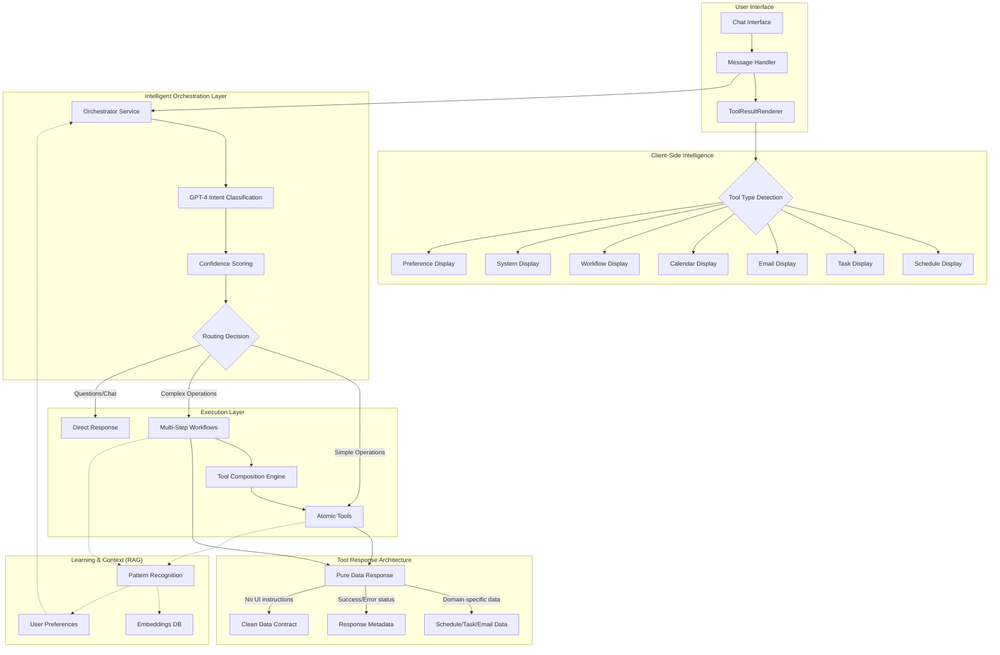

# AI System Reference Documentation

## System Architecture Overview

The Dayli AI assistant operates through a sophisticated multi-layered architecture that combines intelligent orchestration, atomic tool composition, and adaptive multi-step workflows. This design enables complex task automation while maintaining simplicity and predictability.



## Core Components

### 1. Intelligent Orchestration Service

The orchestration layer represents the cognitive center of the system, using GPT-4 to understand intent and make intelligent routing decisions:

```typescript
class OrchestrationService {
  async classifyIntent(message: string, context: OrchestrationContext): Promise<UserIntent> {
    // GPT-4 powered classification with structured output
    // Considers time of day, schedule state, task backlog, and user patterns
    // Returns category: 'workflow' | 'tool' | 'conversation'
    // Includes confidence score (0-1), reasoning, and suggested handler
  }
}
```

**Key Capabilities:**
- **AI-Powered Intent Classification**: Uses GPT-4 with structured output for consistent, intelligent routing
- **Context-Aware Decision Making**: Factors in current time, schedule utilization, task backlog pressure, and email state
- **Intelligent Caching**: LRU cache with 5-minute TTL reduces latency for repeated queries
- **Graceful Fallback**: Keyword-based classification ensures reliability even if AI fails
- **Entity Extraction**: Automatically identifies dates, times, people, tasks, and durations from natural language

**Context Awareness:**
The orchestrator builds rich context for every decision:
- Current time and timezone (morning vs. afternoon behavior)
- Schedule state (empty, busy, fragmented)
- Task pressure (pending, urgent, overdue counts)
- Email backlog (unread, urgent counts)
- User patterns (preferred work times, common requests)

### 2. Atomic Tool System (33 Tools)

The foundation of our system is a comprehensive set of atomic tools that perform focused, single-purpose operations:

```typescript
// Tool Factory Pattern ensures consistency
export function createTool<TParams, TResponse extends BaseToolResponse>({
  name: string,
  description: string,
  parameters: ZodSchema,
  metadata: ToolMetadata,
  execute: (params: TParams) => Promise<TResponse>
}) {
  // Consistent error handling, logging, and response structure
  // Pure data returns without UI formatting
}
```

**Complete Tool Inventory:**

#### Schedule Management Tools (8)
1. `schedule_viewSchedule` - Display time blocks for any date
2. `schedule_createTimeBlock` - Create work, meeting, email, break, or blocked time
3. `schedule_moveTimeBlock` - Relocate existing blocks
4. `schedule_deleteTimeBlock` - Remove time blocks
5. `schedule_fillWorkBlock` - Intelligently assign tasks to work blocks
6. `schedule_findGaps` - Identify available time slots
7. `schedule_batchCreateBlocks` - Create multiple blocks atomically
8. `schedule_analyzeUtilization` - Analyze schedule efficiency and patterns

#### Task Management Tools (7)
1. `task_viewTasks` - List tasks with filtering and sorting
2. `task_createTask` - Create new tasks with smart defaults
3. `task_updateTask` - Modify task properties
4. `task_completeTask` - Mark tasks as done
5. `task_getBacklogWithScores` - Retrieve tasks with intelligent scoring
6. `task_assignToTimeBlock` - Link tasks to specific time blocks
7. `task_suggestForDuration` - Find tasks that fit available time

#### Email Management Tools (9)
1. `email_viewEmails` - List emails with metadata
2. `email_readEmail` - Read full email content
3. `email_processEmail` - Archive, create task, or draft reply
4. `email_getBacklog` - Retrieve unread and backlog emails
5. `email_categorizeEmail` - AI-powered email classification
6. `email_batchCategorize` - Categorize multiple emails efficiently
7. `email_groupBySender` - Group emails for batch processing
8. `email_archiveBatch` - Archive multiple emails at once
9. `email_createTaskFromEmail` - Convert emails to actionable tasks

#### Calendar Tools (2)
1. `calendar_scheduleMeeting` - Create meetings with attendees
2. `calendar_rescheduleMeeting` - Modify existing meetings

#### Preference Tool (1)
1. `preference_updatePreferences` - Modify user settings and preferences

#### System Tools (6)
1. `system_confirmProposal` - Handle workflow confirmations
2. `system_showWorkflowHistory` - Display past workflow executions
3. `system_resumeWorkflow` - Continue paused workflows
4. `system_provideFeedback` - Collect user feedback
5. `system_showPatterns` - Reveal usage patterns and insights
6. `system_clearContext` - Reset conversation state

### 3. Multi-Step Workflow System

Workflows represent sophisticated multi-step operations that compose atomic tools to achieve complex goals:

```typescript
// Workflow Pattern with Proposal-Confirmation Flow
export const schedule = createTool<ScheduleParams, WorkflowScheduleResponse>({
  name: 'workflow_schedule',
  description: 'Multi-step schedule optimization with user confirmation',
  execute: async (params) => {
    // Phase 1: Analysis using atomic tools
    // Phase 2: Proposal generation
    // Phase 3: User confirmation
    // Phase 4: Execution via atomic tools
  }
});
```

**Available Multi-Step Workflows (3):**

#### 1. Schedule Workflow (`workflow_schedule`)
Orchestrates a complete daily planning process:
- **Phase 1 - Analysis**: 
  - Calls `schedule_viewSchedule` to assess current state
  - Uses `schedule_findGaps` to identify opportunities
  - Applies `schedule_analyzeUtilization` for insights
- **Phase 2 - Proposal Generation**:
  - Generates optimal time block proposals
  - Considers user preferences and feedback
  - Calculates estimated utilization
- **Phase 3 - Confirmation**:
  - Presents proposals to user
  - Allows modifications before execution
- **Phase 4 - Execution**:
  - Uses `schedule_batchCreateBlocks` to implement approved changes
  - Verifies final schedule state

#### 2. Work Block Workflow (`workflow_fillWorkBlock`)
Intelligently fills work blocks with appropriate tasks:
- **Analysis Phase**:
  - Retrieves block details and available duration
  - Calls `task_getBacklogWithScores` for prioritized tasks
  - Uses `task_suggestForDuration` for optimal combinations
- **Scoring Algorithm**:
  ```typescript
  score = basePriority(60%) + taskAge(40%) + contextBonus
  // Morning blocks favor complex tasks
  // Afternoon blocks mix quick wins
  ```
- **Execution Phase**:
  - Calls `task_assignToTimeBlock` for approved assignments
  - Updates task status and relationships

#### 3. Email Block Workflow (`workflow_fillEmailBlock`)
Sophisticated email triage and batch processing:
- **Triage Phase**:
  - Uses `email_getBacklog` to fetch unprocessed emails
  - Applies `email_batchCategorize` for AI classification
  - Groups with `email_groupBySender` for efficiency
- **Categorization Matrix**:
  - **Urgent + Important**: Morning focus slots
  - **Can Wait + Important**: Afternoon batch
  - **Not Important**: Quick batch or archive
  - **No Response Needed**: Auto-archive candidates
- **Execution Phase**:
  - Uses `email_archiveBatch` for bulk operations
  - Prepares actionable emails for processing

### 4. Client-Side Rendering Intelligence

The UI layer intelligently interprets pure data responses without explicit formatting instructions:

```typescript
// ToolResultRenderer: Smart display routing
export function ToolResultRenderer({ toolName, result, metadata }) {
  const displayType = metadata?.category || detectTypeFromName(toolName);
  const Display = displays[displayType];
  return <Display data={result} interactionHandlers={handlers} />;
}
```

**Display Components:**
- **ScheduleDisplay**: Interactive timeline with drag-and-drop
- **TaskDisplay**: Scored task cards with quick actions
- **EmailDisplay**: Triage interface with batch operations
- **CalendarDisplay**: Meeting cards with conflict detection
- **WorkflowDisplay**: Multi-step progress visualization
- **SystemDisplay**: Confirmations and system messages
- **PreferenceDisplay**: Settings with immediate effect

### 5. RAG Context System

The learning layer continuously improves personalization through pattern recognition:

```typescript
class RAGContextProvider {
  async buildContext(query: string, userId: string) {
    // Layer 1: Recent executions (last 7 days)
    // Layer 2: Workflow patterns (common sequences)
    // Layer 3: User preferences (learned behaviors)
    return {
      patterns: await this.getRelevantPatterns(query),
      rejections: await this.getRejectionHistory(userId),
      preferences: await this.getLearnedPreferences(userId)
    };
  }
}
```

**Learning Capabilities:**
- **Execution Patterns**: Tracks tool usage sequences
- **Rejection Learning**: Remembers declined suggestions
- **Time Preferences**: Learns optimal times for different activities
- **Implicit Feedback**: Adjusts based on task completion times
- **Cross-User Insights**: Anonymous pattern sharing for better defaults

## Data Flow Example

Let's trace a complex request through the entire system:

1. **User Input**: "Plan my day with focus on deep work"

2. **Orchestration Classification**:
   ```typescript
   {
     category: "workflow",
     confidence: 0.95,
     reasoning: "User wants comprehensive day planning with specific focus preference",
     suggestedHandler: {
       type: "workflow",
       name: "workflow_schedule",
       params: { preferences: { focusType: "deep_work" } }
     },
     entities: {
       dates: ["today"],
       keywords: ["deep work", "focus"]
     }
   }
   ```

3. **Workflow Execution - Phase 1 (Analysis)**:
   - `schedule_viewSchedule` → Current blocks: 2 meetings
   - `schedule_findGaps` → Found: 09:00-11:00, 13:00-17:00
   - `schedule_analyzeUtilization` → Current: 25%, Fragmented: Yes

4. **Workflow Execution - Phase 2 (Proposal)**:
   ```typescript
   {
     proposals: [
       { type: "work", title: "Deep Focus Block", start: "09:00", end: "11:00" },
       { type: "break", title: "Lunch Break", start: "12:00", end: "13:00" },
       { type: "work", title: "Afternoon Focus", start: "13:00", end: "15:00" },
       { type: "email", title: "Email Triage", start: "15:00", end: "15:30" }
     ],
     estimatedUtilization: 75%,
     message: "I've created a schedule optimized for deep work. Shall I proceed?"
   }
   ```

5. **User Confirmation**: "Yes, but make lunch 30 minutes"

6. **Workflow Execution - Phase 3 (Implementation)**:
   - `schedule_batchCreateBlocks` → Creates 4 blocks atomically
   - Returns success with final schedule

7. **Client Rendering**:
   - ToolResultRenderer detects "workflow" type
   - Loads WorkflowDisplay component
   - Shows interactive schedule with completion status

## Performance & Reliability

### Performance Characteristics
- **Intent Classification**: < 300ms (p95)
- **Atomic Tool Execution**: < 2 seconds (p95)
- **Workflow Completion**: < 5 seconds (p95)
- **Cache Hit Rate**: > 40% for common queries
- **UI Update Latency**: < 100ms

### Reliability Features
- **Graceful Degradation**: Falls back to keyword matching if AI fails
- **Atomic Operations**: Database transactions ensure consistency
- **Idempotent Tools**: Safe to retry on failure
- **Proposal Pattern**: Nothing changes without user confirmation
- **Error Boundaries**: Each tool isolated from others

### Scalability Architecture
- **Stateless Tools**: Horizontal scaling ready
- **Cached Classifications**: Reduces AI API calls
- **Batch Operations**: Efficient multi-item processing
- **Progressive Enhancement**: Works with partial feature sets

## Key Design Principles

1. **Separation of Concerns**: Tools return data, UI handles presentation
2. **Atomic Composition**: Complex operations built from simple tools
3. **Intelligence at Every Layer**: From orchestration to rendering
4. **User Control**: Confirmation required for state changes
5. **Graceful Complexity**: Simple tasks stay simple, complex tasks possible

## Implementation Insights

### Why This Architecture Works

1. **Predictable Complexity**: Multi-step workflows are just sequential tool calls
2. **Testable Units**: Each atomic tool can be tested in isolation
3. **Clear Contracts**: Pure data responses enable type safety
4. **Flexible Composition**: New workflows easily created from existing tools
5. **Learning Without Complexity**: RAG enhances without changing core flow

### Architectural Innovations

1. **Proposal-Confirmation Pattern**: Ensures user control while enabling automation
2. **Pure Data Architecture**: Complete separation of logic and presentation
3. **Intelligent Routing**: AI decides complexity level and appropriate handler
4. **Context-Aware Decisions**: Every operation considers current state
5. **Graceful Learning**: System improves without user configuration

## Future Extensibility

The architecture supports seamless addition of:
- **New Atomic Tools**: Via tool factory pattern
- **New Workflows**: By composing existing tools
- **New Display Types**: Through display component system
- **Enhanced Learning**: Via RAG context expansion
- **Additional Intelligence**: Through orchestration improvements

The system's strength lies in its layered intelligence - from the orchestrator's sophisticated routing, through the atomic tools' focused efficiency, to the workflows' coordinated execution, and finally the UI's smart rendering. This creates an AI assistant that delivers immediate value while continuously learning and adapting to each user's unique needs. 