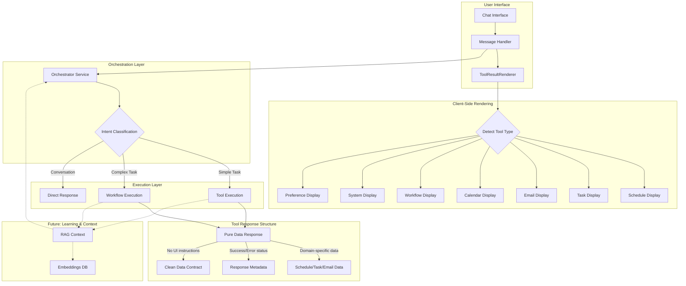

# AI System Reference Documentation

## System Architecture Overview

The Dayli AI assistant operates through a sophisticated multi-layered architecture designed for extensibility, personalization, and efficient task execution.



## Core Components

### 1. Orchestration Service
The brain of the system that intelligently routes requests using AI-powered intent classification:

```typescript
class OrchestrationService {
  async classifyIntent(message: string, context: OrchestrationContext): Promise<UserIntent> {
    // Uses OpenAI to classify intent with structured output
    // Returns category: 'workflow' | 'tool' | 'conversation'
    // Includes confidence score, reasoning, and suggested handler
  }
}
```

**Key Features:**
- AI-powered intent classification using OpenAI's structured output
- Context-aware routing based on schedule state, task backlog, and time of day
- Intelligent caching with LRU eviction (5-minute TTL)
- Fallback to keyword-based classification if AI fails
- Entity extraction (dates, times, people, tasks, duration)

**Context Building:**
The orchestrator considers:
- Current time and timezone
- Schedule utilization and gaps
- Task backlog pressure (pending, urgent, overdue counts)
- Email state (unread, urgent counts)
- User patterns (when available from future RAG integration)

### 2. Tool System

Tools are atomic operations that return pure domain data without any UI formatting instructions:

```typescript
// Tool Factory Pattern
export function createTool<TParams, TResponse extends BaseToolResponse>({
  name: string,
  description: string,
  parameters: ZodSchema,
  metadata: ToolMetadata,
  execute: (params: TParams) => Promise<TResponse>
}) {
  // Consistent error handling, logging, and response structure
}

// Base Response Interface
interface BaseToolResponse {
  success: boolean;
  error?: string;
  timestamp?: Date;
}
```

**Tool Categories (21 total tools):**

1. **Schedule Tools** (5 tools):
   - `schedule_viewSchedule` - View schedule for a specific date
   - `schedule_createTimeBlock` - Create time blocks (work, meeting, email, break, blocked)
   - `schedule_moveTimeBlock` - Move existing time blocks
   - `schedule_deleteTimeBlock` - Delete time blocks
   - `schedule_fillWorkBlock` - Fill work blocks with appropriate tasks

2. **Task Tools** (4 tools):
   - `task_viewTasks` - List tasks with scoring and filters
   - `task_createTask` - Create new tasks
   - `task_updateTask` - Update task properties
   - `task_completeTask` - Mark tasks as complete

3. **Email Tools** (3 tools):
   - `email_viewEmails` - List emails with metadata
   - `email_readEmail` - Read full email content
   - `email_processEmail` - Process email (archive, create task, draft reply)

4. **Calendar Tools** (2 tools):
   - `calendar_scheduleMeeting` - Schedule meetings with attendees
   - `calendar_rescheduleMeeting` - Reschedule existing meetings

5. **Preference Tool** (1 tool):
   - `preference_updatePreferences` - Update user preferences

6. **System Tools** (6 tools):
   - `system_confirmProposal` - Confirm workflow proposals
   - `system_showWorkflowHistory` - Display past executions
   - `system_resumeWorkflow` - Resume paused workflows
   - `system_provideFeedback` - Collect user feedback
   - `system_showPatterns` - Display usage patterns
   - `system_clearContext` - Reset conversation context

### 3. Workflow System

Workflows handle multi-step operations that coordinate multiple tools:

```typescript
// Workflow using AI SDK's tool pattern
export const schedule = createTool<ScheduleParams, WorkflowScheduleResponse>({
  name: 'workflow_schedule',
  description: 'Create and manage time blocks for a day',
  parameters: scheduleSchema,
  metadata: {
    category: 'workflow',
    displayName: 'Schedule Management',
    requiresConfirmation: false,
    supportsStreaming: true,
  },
  execute: async (params) => {
    // Multi-step logic with feedback handling
  }
});
```

**Available Workflows (3 total):**

1. **Schedule Workflow** (`workflow_schedule`)
   - Creates and manages time blocks for a day
   - Supports user feedback to adjust the schedule
   - Can add meetings, work blocks, breaks, and email time
   - Handles schedule conflicts and optimization

2. **Fill Work Block Workflow** (`workflow_fillWorkBlock`)
   - Intelligently fills work blocks with appropriate tasks
   - Uses task scoring: priority + urgency + age
   - Matches task duration to available time
   - Returns assigned tasks with reasoning

3. **Fill Email Block Workflow** (`workflow_fillEmailBlock`)
   - Fills email blocks with triaged emails
   - Categorizes: needs_reply, important_info, potential_task, can_archive
   - Prioritizes by urgency + age (older emails get higher priority)
   - Never auto-archives important emails

### 4. Client-Side Rendering

The UI intelligently renders tool results based on their type:

```typescript
// ToolResultRenderer routes to appropriate display
export function ToolResultRenderer({ toolName, result, metadata }) {
  const displayType = metadata?.category || detectTypeFromName(toolName);
  const Display = displays[displayType];
  return <Display data={result} />;
}

// Specialized displays for each domain
const displays = {
  schedule: ScheduleDisplay,      // Timeline view with blocks
  task: TaskDisplay,              // Task cards with scores
  email: EmailDisplay,            // Email list with actions
  calendar: CalendarDisplay,      // Meeting cards
  workflow: WorkflowDisplay,      // Multi-step results
  system: SystemDisplay,          // System messages
  preference: PreferenceDisplay,  // Settings display
  default: DefaultDisplay         // Fallback display
};
```

**Display Components:**
- **ScheduleDisplay**: Renders time blocks in a timeline view
- **TaskDisplay**: Shows tasks with scores, priorities, and actions
- **EmailDisplay**: Displays emails with triage actions
- **CalendarDisplay**: Shows meetings with attendees and times
- **WorkflowDisplay**: Renders multi-step workflow results
- **SystemDisplay**: Handles confirmations and system messages
- **PreferenceDisplay**: Shows user preferences and settings

### 5. RAG Context System (Planned - Sprint 4.4)

Three-layer context building for personalized responses:

```typescript
// Future implementation
class RAGContextProvider {
  async buildContext(query: string, userId: string) {
    // Layer 1: Recent tool executions
    // Layer 2: Workflow patterns
    // Layer 3: User preferences
  }
}
```

**Planned Features:**
- Embedding of tool results for learning
- Pattern recognition from user behavior
- Rejection pattern tracking
- Personalized suggestions based on history

## Data Flow Example

Let's trace a request through the system:

1. **User**: "Plan my day"

2. **Orchestrator Classification**:
   ```typescript
   {
     category: "workflow",
     confidence: 0.95,
     reasoning: "User wants to plan their day, which requires schedule workflow",
     suggestedHandler: {
       type: "workflow",
       name: "workflow_schedule",
       params: {}
     }
   }
   ```

3. **Workflow Execution**:
   - Analyzes current schedule
   - Identifies gaps and opportunities
   - Creates proposed time blocks
   - Returns structured schedule data

4. **Pure Data Response**:
   ```typescript
   {
     success: true,
     date: "2024-01-20",
     blocks: [
       { type: "work", title: "Deep Focus", start_time: "09:00", end_time: "11:00" },
       { type: "break", title: "Break", start_time: "11:00", end_time: "11:15" },
       { type: "email", title: "Email Triage", start_time: "11:15", end_time: "12:00" }
     ],
     stats: {
       totalBlocks: 8,
       workTime: 360,
       breakTime: 60,
       utilization: 85
     }
   }
   ```

5. **Client Rendering**:
   - ToolResultRenderer detects "workflow" type
   - Loads WorkflowDisplay component
   - Shows interactive schedule with actions

## Intent Classification Examples

The orchestrator uses sophisticated AI classification with fallback patterns:

**Workflow Classifications:**
- "Plan my day" → `workflow_schedule` (confidence: 0.95)
- "What should I work on?" → `workflow_fillWorkBlock` (confidence: 0.88)
- "Process my emails" → `workflow_fillEmailBlock` (confidence: 0.90)

**Tool Classifications:**
- "Show my schedule" → `schedule_viewSchedule` (confidence: 0.92)
- "Create a meeting at 2pm" → `calendar_scheduleMeeting` (confidence: 0.89)
- "Mark task as done" → `task_completeTask` (confidence: 0.91)
- "Block time for deep work" → `schedule_createTimeBlock` (confidence: 0.87)

**Conversation Classifications:**
- "How does task scoring work?" → Direct response (confidence: 0.85)
- "What's the weather?" → Direct response (confidence: 0.90)

## Performance Optimizations

1. **Intent Caching**: LRU cache with 5-minute TTL for repeated queries
2. **Parallel Service Calls**: Context building fetches all data in parallel
3. **Lazy Loading**: Display components loaded on demand
4. **Pure Data Returns**: No LLM formatting overhead in tools
5. **Streaming Support**: Progress updates for long operations

## Error Handling

Consistent error handling across all layers:

```typescript
// All tools return consistent error structure
interface ErrorResponse extends BaseToolResponse {
  success: false;
  error: string;
  errorCode?: string;
  retryable?: boolean;
}

// Orchestrator fallback on AI failure
if (aiClassificationFails) {
  return keywordBasedFallback(message);
}
```

## Key Design Principles

1. **Separation of Concerns**: Tools return pure data, UI handles presentation
2. **Intelligence at the Edge**: Orchestrator makes smart routing decisions
3. **Graceful Degradation**: Fallbacks at every level
4. **Context Awareness**: Decisions consider time, schedule state, and workload
5. **User Control**: Workflows support feedback and modification

## Future Extensibility

The architecture supports easy addition of:
- New tools (via tool factory pattern)
- New workflows (via tool-based workflow pattern)
- New display types (via display components)
- Enhanced learning (via planned RAG integration)
- Additional intelligence layers

The system's strength lies in its layered architecture - the orchestrator's intelligent routing, the tools' focused efficiency, the workflows' coordination capabilities, and the UI's rich rendering create an assistant that delivers immediate value while supporting future enhancements. 